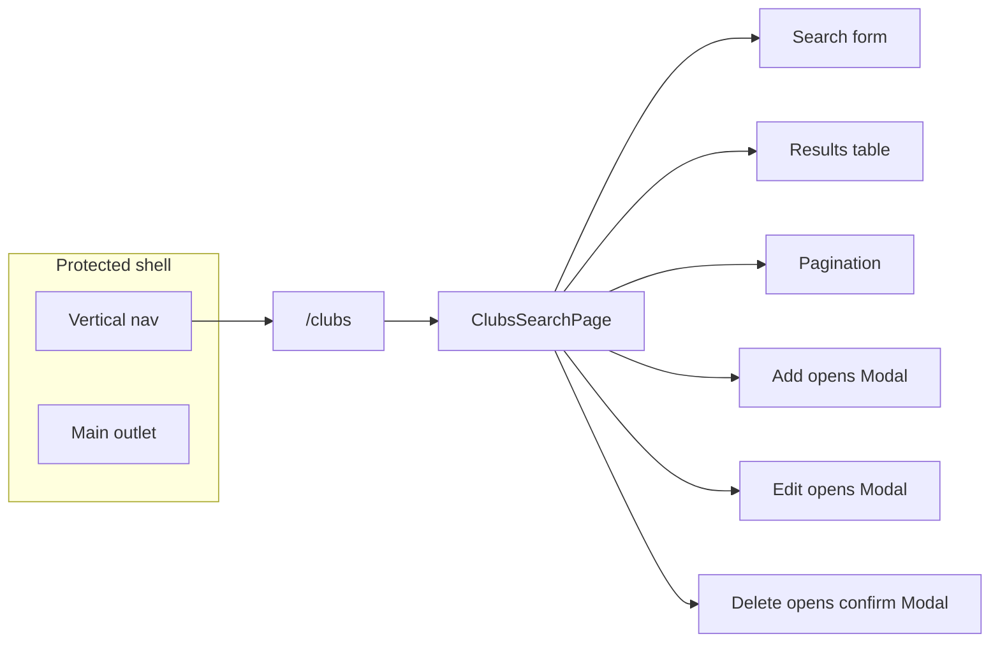

# Build Plan

**Step 1 — Map requirements to `openapi.yaml` (Club API)**

- **Search by name:** `GET /club/find_by_similar_name?name={string}` → `200` body: `ClubDto[]`. Already wrapped by `fetchClubsBySimilarName` in `src/services/clubs.ts` (keep naming aligned with any renames).
- **Create:** `POST /club` with `application/json` **`ClubDto`** → `200` returns `ClubDto`.
- **Update:** `PUT /club` with **`ClubDto`** (full payload) → `200` returns `ClubDto`. Note: the path is **`/club`**, not `/club/{id}`; the server identifies the row via the **`id`** in the body.
- **Delete:** `DELETE /club/{id}` with UUID path param → `200` empty body per spec.
- Reuse **`readApiErrorMessage`** and `apiBase` patterns from existing services.

**Step 1b — Bearer authentication (backend contract)**

- The API treats **every** `/api/v1/**` path as **protected** except **`POST /api/v1/auth/register`** and **`POST /api/v1/auth/login`** (browser URL through the dev server looks like `http://localhost:5173/api/v1/...` because of the Vite proxy).
- All **club** operations (`GET find_by_similar_name`, `POST`, `PUT`, `DELETE` on `/club`) must include **`Authorization: Bearer <access_token>`** using the token stored after login (`AuthSession.token` / `useAuth().session?.token`).
- Root **`AGENTS.md`** (*Backend API authentication*) is the normative project rule; UI-only protection (`ProtectedRoute`) is not enough—the server returns **401** without a valid bearer token.
- **Implementation sketch:** add a small helper (e.g. **`bearerAuth(token: string)`** returning `{ Authorization: \`Bearer ${token}\` }`) in **`src/lib/api.ts`**, merge it with `Content-Type` on mutating requests, and give every **`clubs.ts`** function a **`token: string`** argument (or an options object that always includes `token`). **`ClubsSearchPage`** reads the token from **`useAuth()`** and passes it into search/refetch and into **`ClubFormModal`** / **`DeleteClubConfirmModal`** (props or callbacks) so all service calls are covered.
- **Implemented in repo:** `bearerAuth` / `jsonAuthHeaders` in **`src/lib/api.ts`**; all **`clubs.ts`** functions take **`token`** first; **`ClubsSearchPage`** / modals pass **`session.token`**; **`players.ts`** and **`matches.ts`** also require **`token`** for future callers; **`useMatch`** reads **`useAuth().session?.token`**.

**Step 2 — Extend `src/services/clubs.ts`**

- Add **`createClub(token, dto)`** (or equivalent) → `POST` `/api/v1/club` with **Bearer** + JSON body.
- Add **`updateClub(token, dto)`** → `PUT` `/api/v1/club` with **Bearer** + JSON body.
- Add **`deleteClub(token, id)`** → `DELETE` `/api/v1/club/{encodeURIComponent(id)}` with **Bearer**.
- **`fetchClubsBySimilarName(token, name)`** → `GET` with **Bearer** on the query request.
- Handle `400` / `401` / `500` (and other documented codes) with thrown `Error` + API message when present; consider surfacing **401** (“Session expired—sign in again”) where appropriate.

**Step 3 — Pagination strategy (spec gap)**

- The OpenAPI definition for **`find_by_similar_name`** does **not** expose `page`, `limit`, or cursor parameters; the response is a **single array**.
- **Default implementation:** apply **client-side pagination** over the last successful search result (e.g. fixed `PAGE_SIZE`, slice, Prev/Next + current page label). Document in **Notes** that server-side pagination requires a **backend + spec change** if lists grow large.
- Alternative (only if product insists on server pagination first): mark FEAT-004 **blocked** until the API supports it—avoid inventing query params not in the spec.

**Step 4 — Routing**

- Register a **protected** route (sibling of `dashboard` / `settings`, still under **`ProtectedAppLayout`**), e.g. **`path: 'clubs'`** → lazy-loaded page component.
- URL suggestion: `/clubs` (flat, consistent with `/settings`).

**Step 5 — Vertical menu (`Clubs search`)**

- Update **`src/components/layout/protected-nav.ts`**: add an item **label** exactly **`Clubs search`** (per `FEATURES.md`), **`to: '/clubs'`**, and a **lucide-react** icon (e.g. `Building2` or `Search`).

**Step 6 — UI primitive: modal**

- There is no **`Modal`** under `src/components/ui/` yet. Add **`Modal.tsx`** (named export, optional `className`, `title`, children, footer slot or actions, `open` + `onOpenChange` / `onClose`, focus-friendly close control) using **Tailwind** + **`cn()`**, per root `AGENTS.md` “Adding a UI Primitive”.
- Use it for: **add club**, **edit club**, and **confirm delete** (three usages or one reusable form modal + one confirm dialog).

**Step 7 — Feature UI (`src/components/features/clubs/`)**

- **`ClubsSearchPage`** (or split list + form):  
  - Obtain **`token`** from **`useAuth().session?.token`**; if missing, avoid calling club APIs (the route should already be protected, but guard defensively). Pass **`token`** into every club service call and into **`ClubFormModal`** / **`DeleteClubConfirmModal`** so mutations and refetch stay authenticated.  
  - **Search form:** text input + submit; on submit call search service with **Bearer**; show loading and error states.  
  - **Results:** table or stacked rows showing at least **name** and **id**; include **`yearRanges`** if useful (optional chips).  
  - **Pagination controls** (client-side): disabled Prev on first page, disabled Next on last page, “Page x of y” or equivalent.  
  - **Add new club** button → modal with fields aligned to **`ClubDto`** (`name` required; `id` for create—use **`crypto.randomUUID()`** unless backend docs say otherwise; `yearRanges` optional—simple comma-separated → `string[]` or repeated inputs).  
  - Per row: **Edit** → same form modal with existing `ClubDto`; **Delete** → confirm modal then `deleteClub` (both with **Bearer**).  
- Keep **`PageWrapper`** on the page shell (`title` e.g. “Clubs search”) for consistency with `Dashboard` / `Settings`.

**Step 8 — State and refresh**

- After successful create/update/delete, **refresh the current search** (re-run the last query) or **optimistically** update local list—pick one approach and stay consistent; simplest is re-fetch with last submitted search term.

**Step 9 — Verification**

- Run **`npm run type-check`** and **`npm run lint`**.
- Manual smoke **with auth enabled** on the API: confirm **no 401** on club routes when logged in; optionally verify **401** when the token is omitted (e.g. temporary code change) to prove the client is sending **`Authorization`**.
- Search, paginate, add, edit, delete against a running backend (or mocked responses if you add tests later—out of scope unless the task says so).

---

## Wireframes

Wireframes describe **layout and hierarchy** only (not final copy or colours). They assume the existing app shell: **header** (brand + logout) and **FEAT-003** vertical nav on the left for authenticated routes.

### Desktop — `/clubs` main content (inside `ProtectedAppLayout` + `PageWrapper`)

```
┌─────────────────────────────────────────────────────────────────────────────┐
│  Header:  TT League                                          [ Logout ]     │
├──────────────┬──────────────────────────────────────────────────────────────┤
│  Overview    │  Clubs search                                                    │
│  Settings    │  ────────────────────────────────────────────────────────────  │
│  Clubs       │                                                                  │
│  search ◀    │   [ Add new club ]                                               │
│              │                                                                  │
│              │   Search                                                         │
│              │   ┌──────────────────────────────────────┐  [ Search ]          │
│              │   │ Club name…                         │                      │
│              │   └──────────────────────────────────────┘                      │
│              │                                                                  │
│              │   ( loading spinner / error banner if any )                      │
│              │                                                                  │
│              │   ┌─────────────────────────────────────────────────────────┐  │
│              │   │ Name          │ ID (uuid…)    │ Seasons      │ Actions   │  │
│              │   ├───────────────┼───────────────┼──────────────┼───────────┤  │
│              │   │ CTT Example   │ 0000…0001     │ 2023-2024    │ Edit Del  │  │
│              │   │ …             │ …             │ …            │ …         │  │
│              │   └─────────────────────────────────────────────────────────┘  │
│              │                                                                  │
│              │   Page 1 of 3        [ Previous ]  [ Next ]                      │
│              │                                                                  │
└──────────────┴──────────────────────────────────────────────────────────────┘
```

- **Empty state (no search run yet):** show short hint under the search row (“Enter a name and search”) instead of an empty table, or a single row placeholder—pick one and keep it consistent.
- **No results:** table area shows “No clubs match this search” (or equivalent).

### Desktop — modal: Add club / Edit club

```
                        ┌─────────────────────────────────────┐
                        │  Add club                       ✕   │
                        ├─────────────────────────────────────┤
                        │  Name *                             │
                        │  ┌─────────────────────────────────┐ │
                        │  │                                 │ │
                        │  └─────────────────────────────────┘ │
                        │  Year ranges (optional)             │
                        │  ┌─────────────────────────────────┐ │
                        │  │ e.g. 2023-2024, 2024-2025       │ │
                        │  └─────────────────────────────────┘ │
                        │  ( Edit: show read-only ID uuid )    │
                        ├─────────────────────────────────────┤
                        │           [ Cancel ]  [ Save ]       │
                        └─────────────────────────────────────┘
```

- **Add:** `id` is generated in code (`crypto.randomUUID()` unless backend says otherwise)—**do not** show an `id` field unless you expose it read-only after create.
- **Edit:** show **read-only** `id` (and optionally pre-filled `yearRanges` / `name`).

### Desktop — modal: Delete confirmation

```
                        ┌─────────────────────────────────────┐
                        │  Delete club                    ✕   │
                        ├─────────────────────────────────────┤
                        │  Delete “CTT Example”? This cannot  │
                        │  be undone.                         │
                        ├─────────────────────────────────────┤
                        │        [ Cancel ]  [ Delete ]       │
                        └─────────────────────────────────────┘
```

### Mobile / narrow viewport

- **Vertical nav:** reuse FEAT-003 drawer; **Clubs search** appears in the same list as Overview / Settings.
- **Toolbar:** “Add new club” may move below the title or full-width above search; keep tap targets ≥ ~44px height.
- **Table:** either **horizontal scroll** (`overflow-x-auto` on a wrapper) or **card rows** (club name prominent, id + seasons smaller, actions as buttons). Choose one pattern for MVP; cards often read better on phones.

### High-level screen map (mermaid)



---

## Component & file list

Files to add or touch for FEAT-004. **New** items are the main work; **edit** items are small integrations.

| Path | Action | Purpose |
|------|--------|---------|
| `src/pages/ClubsSearch.tsx` | **Add** | Thin route target: wraps feature in `PageWrapper`, exports `ClubsSearch` for the router. |
| `src/components/features/clubs/ClubsSearchPage.tsx` | **Add** | Orchestrates search state, modals, pagination slice, loading/error; composes child components below. |
| `src/components/features/clubs/ClubSearchForm.tsx` | **Add** | Controlled name input + submit; calls parent `onSearch(term)`. |
| `src/components/features/clubs/ClubsResultsTable.tsx` | **Add** | Renders result rows + column headers; `onEdit` / `onDelete` per row. |
| `src/components/features/clubs/ClubsPagination.tsx` | **Add** | Prev/Next + “Page x of y”; props: `page`, `pageCount`, `onPageChange`. |
| `src/components/features/clubs/ClubFormModal.tsx` | **Add** | Add/edit `ClubDto`: name, optional year ranges string → `string[]`; `mode: 'add' \| 'edit'`. |
| `src/components/features/clubs/DeleteClubConfirmModal.tsx` | **Add** | Confirm copy + Cancel / Delete; receives `club: ClubDto` or `name` + `id`. |
| `src/components/ui/Modal.tsx` | **Add** | Reusable overlay, panel, title, close, `open`/`onOpenChange`, `className`, focusable close. |
| `src/lib/api.ts` | **Edit** | Optional: export **`bearerAuth(token)`** (or merge helper) for `Authorization: Bearer …` headers. |
| `src/services/clubs.ts` | **Edit** | All club calls accept **`token`** and send **Bearer**; includes `fetchClubsBySimilarName`, `createClub`, `updateClub`, `deleteClub`. |
| `src/router.tsx` | **Edit** | Lazy `path: 'clubs'` → `ClubsSearch`, sibling to `dashboard` / `settings` under `ProtectedAppLayout`. |
| `src/components/layout/protected-nav.ts` | **Edit** | New item: label **`Clubs search`**, `to: '/clubs'`, icon (e.g. `Building2`). |

Optional (only if `ClubsSearchPage.tsx` grows too large):

| Path | Action | Purpose |
|------|--------|---------|
| `src/hooks/useClubSearch.ts` | **Add** | Encapsulate `{ results, loading, error, search, refetch }` or similar. |
| `src/components/features/clubs/club-year-ranges.ts` | **Add** | Pure helpers: parse comma-separated seasons ↔ `string[]`. |

**Out of scope for this file list unless scope changes:** new global types (reuse `ClubDto`), E2E tests, Storybook, API mocks.

### Acceptance criteria → artifacts (traceability)

| `FEATURES.md` criterion | Primary deliverable |
|------------------------|---------------------|
| Club search page in app | `ClubsSearch.tsx` + router entry |
| Menu item **Clubs search** | `protected-nav.ts` |
| Form to search by name | `ClubSearchForm.tsx` |
| List of matching clubs | `ClubsResultsTable.tsx` |
| Pagination | `ClubsPagination.tsx` + client slice in `ClubsSearchPage` |
| Button add new club | `ClubsSearchPage` + `ClubFormModal` + `createClub` |
| Button edit club | Row action + `ClubFormModal` + `updateClub` |
| Button delete club | Row action + `DeleteClubConfirmModal` + `deleteClub` |
| Bearer auth on club API | `src/lib/api.ts` helper + **`clubs.ts`** + **`ClubsSearchPage`** / modals passing **`session.token`** |

# Implementation Guidelines

- **No `any`**; reuse **`ClubDto`** from `src/types/index.ts`.
- **All HTTP calls** stay in **`src/services/clubs.ts`** (or split `clubs.ts` only if the file grows unwieldy—prefer one service file for this domain slice).
- **Protected API:** follow **`AGENTS.md`** (*Backend API authentication*); every club `fetch` must include the session bearer token.
- **Tailwind + `cn()`** only; no new dependencies (modal is hand-built).
- **Named exports** for components and explicit prop **`interface`**s.

# Notes

- **Depends on FEAT-003:** menu + `ProtectedAppLayout` must exist so **`Clubs search`** appears in the vertical nav.
- **Club `id` on create:** confirm with backend whether the client must send a UUID or the server generates it; the OpenAPI **example** shows a client UUID—adjust the form if the API differs.
- **`openapi.yaml`** may not mark every club path with `security: bearerAuth`; the **actual backend** still requires a JWT for those routes—treat the product rule in **`AGENTS.md`** as source of truth for the frontend.
