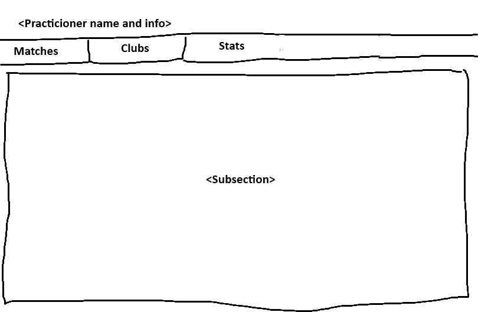

# FEATURES.md — Feature Registry & Build Plans

This file is the single source of truth for planned, in-progress, and completed features.

**For humans:** Add new features under `## Backlog` using the template below.
**For agents:** Only work on features marked `status: ready`. Update status as you progress. Never modify features marked `status: done` or `status: in-progress` unless explicitly asked.

---

## Status Legend

| Status | Meaning |
|-|-|
| `idea` | Captured but not planned yet — no build plan written |
| `planned` | Build plan written, not yet ready to implement |
| `ready` | Build plan approved, agent can start |
| `in-progress` | Currently being implemented |
| `done` | Shipped |
| `blocked` | Waiting on a dependency or decision |

---

## Template

Copy this block to add a new feature:

```
### [FEAT-000] Feature Name
- **Status:** idea
- **Priority:** low | medium | high
- **Effort:** small (< 2h) | medium (2–8h) | large (> 8h)
- **Depends on:** —

#### Goal
One sentence: what problem does this solve for the user?

#### Acceptance Criteria
- [ ] Criterion 1
- [ ] Criterion 2

#### Feature Details
→ See [FEAT-000-DETAILS.md](./FEAT-000-DETAILS.md) for a detailed breakdown of the feature, build plan, and implementation steps.

```

### Feature Details file format
```
# Build Plan
> Fill this in when status moves to `planned`.

1. Step 1
2. Step 2
...

# Implementation Guidelines

# Notes
Any open questions, design decisions, or links.
```

## In Progress

## Backlog

## Done

### [FEAT-015] Remove all filters in the Practicioner details Stats subsection and keep only competition_scope, competition_type and competition_category.
- **Status:** done
- **Priority:** high
- **Effort:** medium
- **Depends on:** FEAT-014

#### Goal
- Remove all filters in the Practicioner details Stats subsection and keep only competition_scope, competition_type and competition_category.

#### Acceptance Criteria
- [x] The filters are removed from the Practicioner details Stats subsection and keep only competition_scope, competition_type and competition_category.
- [x] Matches used for the Stats subsection (bar chart and counts) are filtered by competition_scope, competition_type and competition_category.

#### Feature Details
→ See [FEAT-015-DETAILS.md](./FEAT-015-DETAILS.md) for a detailed breakdown of the feature, build plan, and implementation steps.

---

### [FEAT-014] Remove cloud scatter chart from Practicioner details Stats subsection
- **Status:** done
- **Priority:** high
- **Effort:** medium
- **Depends on:** FEAT-013

#### Goal
- Remove the cloud scatter chart from the Practicioner details Stats subsection
- (Also shipped: Stats filters for the bar chart, competition fields on match search rows/cards, GraphQL search field extension — see details file.)

#### Acceptance Criteria
- [x] The cloud scatter chart is removed from the Practicioner details Stats subsection.

#### Feature Details
→ See [FEAT-014-DETAILS.md](./FEAT-014-DETAILS.md) for a detailed breakdown of the feature, build plan, and implementation steps.

---

### [FEAT-013] Improvements in Stats subsection of Practicioner details section.
- **Status:** done
- **Priority:** high
- **Effort:** medium
- **Depends on:** FEAT-012

#### Goal
Improve the Stats subsection of the Practicioner details section:
- Remove registrations for the season from the stats subsection.
- Build a match distribution Bar Chart as an HTML widget.
  - Chart type: grouped bar chart (wins vs losses side by side)
  - Opponents: 6 opponents labeled A, B, C, X, Y, Z
  - Omit ties from the chart.
  - Style it cleanly with flat design, no gradients or shadows. Use green (#639922) for wins and red (#E24B4A) for losses.
  - The Bar Chart should be displayed in the stats subsection.

#### Acceptance Criteria
- [x] The registrations for the season are removed from the stats subsection.
- [x] The match distribution Bar Chart is displayed in the stats subsection.
- [x] The match distribution Bar Chart is styled cleanly with flat design, no gradients or shadows. Use green (#639922) for wins and red (#E24B4A) for losses.
- [x] The match distribution Bar Chart is styled with green (#639922) for wins and red (#E24B4A) for losses.

#### Feature Details
→ See [FEAT-013-DETAILS.md](./FEAT-013-DETAILS.md) for a detailed breakdown of the feature, build plan, and implementation steps.

---

### [FEAT-012] Practicioner details section in Practicioners search page imporvements.
- **Status:** done
- **Priority:** high
- **Effort:** medium
- **Depends on:** FEAT-010

#### Goal
Improve the Practicioner details section in the Practicioners search page:
- Season selector:
  - Selector with options from the seasons search page: sorted descending by year ["2018-2019", "2019-2020", "2020-2021", "2021-2022", "2022-2023", "2023-2024", "2024-2025"]
  - The selector is used to filter the matches, clubs and stats data.
  - The selector is used to display the matches, clubs and stats data for the selected season.
- Matches subsection:
  - Before the matches list, a summary of the matches is displayed with the following information:
    - Total matches: the total number of matches where the practicioner has participated in the selected season.
    - Total wins: the total number of matches where the practicioner has won the match in the selected season.
    - Total losses: the total number of matches where the practicioner has lost the match in the selected season.
    - Total ties: the total number of matches where the practicioner has tied the match in the selected season.
  - Matches list can be sorted by day number ascending or descending.
  - Matches card style is RED when the practicioner has lost the match.
  - Matches card style is GREEN when the practicioner has won the match.
  - Matches card style is YELLOW when the practicioner has tied the match.

  - Clubs subsection:
    - Clubs list can be sorted by name ascending or descending.
    - Season Ranges column displays the years range where the practicioner has been a member of the club.
  
  - Stats subsection:
    - Will display a point cloud scatter chart of the practicioner's matches.
    - The chart will display 2 axes:
      - X axis: 0, 1, 2, 3 as the scored points in the match.
      - Y axis: A, B, C, X, Y, Z as the letter the practicioner is asigned to the match

#### Notes
- The matches, clubs and stats data is retrieved from the backend using the GraphQL adapter.
- The point cloud scatter chart is displayed using the react-chartjs-2 library.
- Mapping for the terms: local<->home, visitor<->away.
- Winning player A over player B means that player A has won the match and player A score is higher than player B score.

#### Acceptance Criteria
- [x] The Matches subsection is improved and displays the matches where the practicioner has participated in the selected season.
- [x] The Clubs subsection is improved and displays the clubs where the practicioner is a member of or has been for the selected season.
- [x] The Stats subsection is improved and displays a point cloud scatter chart of the practicioner's matches in the selected season.

#### Feature Details
→ See [FEAT-012-DETAILS.md](./FEAT-012-DETAILS.md) for a detailed breakdown of the feature, build plan, and implementation steps.

---

### [FEAT-011] Update rest adapter and related logic from openapi.yaml spec
- **Status:** done
- **Priority:** high
- **Effort:** medium
- **Depends on:** —

#### Goal
Re-align **`src/types`**, **`src/services/*`**, and UI with the current **`openapi.yaml`** snapshot after contract changes (iteration after FEAT-007).

#### Acceptance Criteria
- [x] Types and service paths/methods match the published **`openapi.yaml`** (incl. register **`email`**, **`ClubMember`** / full **`season_player`** surface in services, practicioner CRUD removed where absent from spec)
- [x] All API calls go through **`src/lib/rest-adapter.ts`**; **`npm run type-check`**, **`npm run lint`**, and **`npm run test`** pass

#### Feature Details
→ See [FEAT-011-DETAILS.md](./FEAT-011-DETAILS.md) for a detailed breakdown of the feature, build plan, and implementation steps.

---

### [FEAT-010] Add Practicioners details section to the Practicioners search page.
- **Status:** done
- **Priority:** high
- **Effort:** medium
- **Depends on:** -

#### Goal
Add a section to the Practicioners search page to display the details of the practicioner.
This section is in the lower part of the page and it is displayed when a practicioner is selected from the Practicioners search page.
This section should have the following information:
- Practicioner name
- Subsections accessible from a horizontal menu at the top of the section.
- Subsections:
  - Matches. This subsection should display the matches where the practicioner has participated this last season.
  - Clubs. This subsection should display the clubs where the practicioner is a member of or has been for the last years.
  - Stats. This subsection should display the stats of the practicioner.

##### Practicioner details wireframe


#### Acceptance Criteria
- [x] The Practicioners details section is added to the Practicioners search page.
- [x] The Practicioners details section is displayed when a practicioner is selected from the Practicioners search page.
- [x] The Matches subsection is displayed and it displays the matches where the practicioner has participated this last season.
- [x] The Clubs subsection is displayed and it displays the clubs where the practicioner is a member of or has been for the last years.
- [x] The Stats subsection is displayed and it displays the stats of the practicioner.

#### Feature Details
→ See [FEAT-010-DETAILS.md](./FEAT-010-DETAILS.md) for a detailed breakdown of the feature, build plan, and implementation steps.

---

### [FEAT-009] Add Matches search page. The page is accessible from the vertical menu with a new menu item `Matches search`.
- **Status:** done
- **Priority:** high
- **Effort:** medium
- **Depends on:** -

#### Goal
Add a page to search for matches by name. The page should display a list of matches that match the search. The matches are retrieved from the backend using the GraphQL adapter.

The list should be paginated and should have a form to search for matches by name.
- The page should have a button to clear the search filters.
- The pagination window size is 10 items per page.

The match item displayed is a card with the following information:
- season, matchDayNumber, home player letter, home player name, home player score, away player letter, away player name, away player score.

The form to search for matches by name should have the following fields:
 - **season**: (selector with options from the seasons search page: ["2018-2019", "2019-2020", "2020-2021", "2021-2022", "2022-2023", "2023-2024", "2024-2025"])
 - **competition scope**: (selector with options from the competitions search page: ["-All-", "provincial", "nacional"]. If "-All-" is selected, the api will omit this property from the query.)
 - **competition scope tag**: (selector with options from the competitions search page: ["-All-", "esp", "bcn"]. If "-All-" is selected, the api will omit this property from the query.)
 - **competition type**: (selector with options from the competitions search page: ["-All-", "senior", "SENIOR", "VETERANS"]. If "-All-" is selected, the api will omit this property from the query.)
 - **match day number**: (text input. If not provided, the api will omit this property from the query.)
 - **practitioner name**: (text input, case insensitive partial match)
 - **competition category**: (selector with options from the competitions search page: ["-All-", "divisio-honor", "primera-nacional", "segona-nacional", "super-divisio", "BCN_SENIOR_PROVINCIAL_1A", "BCN_SENIOR_PROVINCIAL_2A_A", "BCN_SENIOR_PROVINCIAL_2A_B", "BCN_SENIOR_PROVINCIAL_3A_A", "BCN_SENIOR_PROVINCIAL_3A_B", "BCN_SENIOR_PROVINCIAL_4A", "BCN_VETERANS_1A", "BCN_VETERANS_2A_A", "BCN_VETERANS_2A_B", "BCN_VETERANS_3A_A", "BCN_VETERANS_3A_B", "BCN_VETERANS_4A_A", "BCN_VETERANS_4A_B"]). If "-All-" is selected, the api will omit this property from the query.)

#### Acceptance Criteria
- [x] The matches search page is added to the app and is accessible from the vertical menu with a new menu item `Matches search` and it displays a list of matches that match the search. The match item displayed is a card with the following information: season, matchDayNumber, home player letter, home player name, home player score, away player letter, away player name, away player score.
- [x] The matches search page has a form to search for matches by name. The form should have the following fields: season, competition scope, competition scope tag, competition type, match day number, practitioner name fragment, competition category.
- [x] The matches search page has a pagination to navigate through the list of matches.

#### Feature Details
→ See [FEAT-009-DETAILS.md](./FEAT-009-DETAILS.md) for a detailed breakdown of the feature, build plan, and implementation steps.

---

### [FEAT-008] Refactor /src/lib adapters and add support for having both Rest and GraphQL adapters.
- **Status:** done
- **Priority:** high
- **Effort:** medium
- **Depends on:** -

#### Goal
Refactor `src/lib` so **REST** and **GraphQL** each have a single, documented HTTP layer, sharing URL/auth helpers where sensible.

- **REST:** Keep or lightly reorganize the existing adapter (`requestJson` / `requestVoid`); OpenAPI remains the contract reference (`openapi.yaml`, read-only).
- **GraphQL:** Add a fetch-based adapter for **queries** (mutations when they appear in `schema.graphqls`); `schema.graphqls` is the operation reference; map to `src/types/index.ts` where shapes match REST DTOs.
- **Auth:** Both adapters take optional `token` and send `Authorization: Bearer …` when set. **`useAuth()` from `src/store/AuthContext.tsx`** supplies the token in the UI; hooks or pages pass it into `src/services/*` (see `src/hooks/useMatches.ts`). **`src/services/auth.ts`** stays the only module that calls register/login without a token.

#### Acceptance Criteria
- [x] The /src/lib adapters are refactored and support having both Rest and GraphQL adapters.
- [x] The /src/lib adapters are tested and work correctly.
- [x] The /src/lib adapters are documented and easy to understand.
- [x] The Authentication is integrated into the Rest and GraphQL adapters.
- [x] The Authentication is tested and works correctly.
- [x] The Authentication is documented and easy to understand.

#### Feature Details
→ See [FEAT-008-DETAILS.md](./FEAT-008-DETAILS.md) for a detailed breakdown of the feature, build plan, and implementation steps.

---

### [FEAT-007] Update rest adapter and related logic from openapi.yaml spec
- **Status:** done
- **Priority:** high
- **Effort:** medium
- **Depends on:** —

#### Goal
Re-align **`src/types`**, **`src/services/*`**, and UI with the current **`openapi.yaml`** snapshot after contract changes (iteration after FEAT-006).

#### Acceptance Criteria
- [x] Types and service paths/methods match the published **`openapi.yaml`** (incl. register **`email`**, **`ClubMember`** / full **`season_player`** surface in services, practicioner CRUD removed where absent from spec)
- [x] All API calls go through **`src/lib/rest-adapter.ts`**; **`npm run type-check`**, **`npm run lint`**, and **`npm run test`** pass
- [x] Root **`AGENTS.md`** / adapter docs updated where behaviour changed (**`RegisterCredentials`**)

#### Feature Details
→ See [FEAT-007-DETAILS.md](./FEAT-007-DETAILS.md) for a detailed breakdown of the feature, build plan, and implementation steps.

---

### [FEAT-006] Update rest adapter and related logic from openapi.yaml spec
- **Status:** done
- **Priority:** high
- **Effort:** medium
- **Depends on:** FEAT-005

#### Goal
Consolidate HTTP access into a documented **REST adapter** (central **`fetch`** + **`apiBase`** + Bearer + error handling), migrate **`src/services/*`** to use it, and align **`src/types`** with the **published** **`openapi.yaml`**. The YAML is **read-only** in this repo—replace it only from the backend export, then adapt code (see root **`AGENTS.md`**).

#### Acceptance Criteria
- [x] A single REST/HTTP adapter layer exists (see **`FEAT-006-DETAILS.md`**) and **`src/services/*`** use it without duplicating low-level **`fetch`** patterns
- [x] Types and service calls match the current **`openapi.yaml`** snapshot after replacement from the backend
- [x] Adapter covered by **Vitest** unit tests (mocked **`fetch`**) for success and error paths
- [x] Root **`AGENTS.md`** documents the adapter (when to pass **`token`**, where HTTP lives)
- [x] **`npm run type-check`** and **`npm run lint`** pass; manual smoke against the API succeeds for auth + at least one protected flow

#### Feature Details
→ See [FEAT-006-DETAILS.md](./FEAT-006-DETAILS.md) for a detailed breakdown of the feature, build plan, and implementation steps.

---

### [FEAT-005] Add practicioners search page
- **Status:** done
- **Priority:** high
- **Effort:** medium
- **Depends on:** FEAT-003

#### Goal
Add a page to search for practicioners by name. The page is accessible from the vertical menu with a new menu item `Practicioners search`.

**OpenAPI:** **`openapi.yaml`** includes **Practicioner API** paths (search, create, update, delete) aligned with the **Club** pattern; the backend must implement these routes for the UI to succeed at runtime. All **`/api/v1/...`** calls from this feature **except** register/login send **`Authorization: Bearer <token>`** (see **`docs/sdd/AGENTS.md`** and root **`AGENTS.md`**).

#### Acceptance Criteria
- [x] The practicioners search page is added to the app
- [x] The practicioners search page is accessible from the vertical menu with a new menu item `Practicioners search`
- [x] The practicioners search page has a form to search for practicioners by name
- [x] The practicioners search page has a list of practicioners that match the search
- [x] The practicioners search page has a pagination to navigate through the list of practicioners
- [x] The practicioners search page has a button to add a new practicioner
- [x] The practicioners search page has a button to edit a practicioner
- [x] The practicioners search page has a button to delete a practicioner
- [x] Every practicioner API call from this feature sends **`Authorization: Bearer <token>`** using the session token; behaviour matches **`AGENTS.md`**

#### Feature Details
→ See [FEAT-005-DETAILS.md](./FEAT-005-DETAILS.md) for a detailed breakdown of the feature, build plan, and implementation steps.

---

### [FEAT-004] Add club search page
- **Status:** done
- **Priority:** high
- **Effort:** medium
- **Depends on:** FEAT-003

#### Goal
Add a page to search for clubs by name. The page is accessible from the vertical menu with a new menu item `Clubs search`.
The page should display a list of clubs that match the search. The list should be paginated and should have a form to search for clubs by name.
The page should have a button to add a new club.
The page should have a button to edit a club.
The page should have a button to delete a club.

The backend secures **all** `/api/v1/...` routes except **`POST /auth/register`** and **`POST /auth/login`**: club search/create/update/delete send **`Authorization: Bearer <token>`** from the signed-in session (see root **`AGENTS.md`** — *Backend API authentication*).

#### Acceptance Criteria
- [x] The club search page is added to the app
- [x] The club search page is accessible from the vertical menu with a new menu item `Clubs search`
- [x] The club search page has a form to search for clubs by name
- [x] The club search page has a list of clubs that match the search
- [x] The club search page has a pagination to navigate through the list of clubs
- [x] The club search page has a button to add a new club
- [x] The club search page has a button to edit a club
- [x] The club search page has a button to delete a club
- [x] Every club API call from this feature (`find_by_similar_name`, create, update, delete) sends **`Authorization: Bearer <token>`** using the session token; behaviour matches **`AGENTS.md`**

#### Feature Details
→ See [FEAT-004-DETAILS.md](./FEAT-004-DETAILS.md) for a detailed breakdown of the feature, build plan, and implementation steps.

---

### [FEAT-003] Add vertical menu in Dashboard page
- **Status:** done
- **Priority:** high
- **Effort:** medium
- **Depends on:** FEAT-002

#### Goal
Add a vertical menu in the Dashboard page to navigate to the different sections of the app.

#### Acceptance Criteria
- [x] The vertical menu is added to the Dashboard page
- [x] The vertical menu is responsive and works on all screen sizes
- [x] The vertical menu is styled using the Tailwind CSS classes

#### Feature Details
→ See [FEAT-003-DETAILS.md](./FEAT-003-DETAILS.md) for a detailed breakdown of the feature, build plan, and implementation steps.

---

### [FEAT-002] Update openapi spec and related logic
- **Status:** done
- **Priority:** high
- **Effort:** medium
- **Depends on:** -

#### Goal
The openapi.yaml spec has been updated and the related logic needs to be adapted

#### Acceptance Criteria
- [x] `openapi.yaml` matches the backend contract (version/source noted if helpful)
- [x] `src/types` DTOs align with `components.schemas` for every endpoint the frontend calls
- [x] `src/services/*` paths, methods, and payloads match the spec; match/club/player types match responses
- [x] `npm run type-check` and `npm run lint` pass after changes

#### Feature Details
→ See [FEAT-002-DETAILS.md](./FEAT-002-DETAILS.md) for a detailed breakdown of the feature, build plan, and implementation steps.

---

### [FEAT-001] Access control and Navigation
- **Status:** done
- **Priority:** high
- **Effort:** medium
- **Depends on:** —

#### Goal
Allow users to sign up, log in, and maintain a session so the app can show personalised content.

#### User Personas
- **Guest:** Unauthenticated user who can only see public content.
- **Member:** Authenticated user with access to the dashboard and settings.

#### Navigation & Access Control
- **Public Routes:** - Landing Page (`/`): Public features.
  - Login Page (`/login`): Simple email/password entry.
  - Sign up alternative link (`/register`):  Simple email/password entry.
- **Protected Routes:**
  - Dashboard (`/dashboard`): Primary data visualization.
  - Settings (`/settings`): User profile and app preferences.
- **Security Rule:** Any attempt to access `/dashboard` or `/settings` without a valid session must redirect the user to `/login`.

#### Acceptance Criteria
- [x] User can register with email + password
- [x] User can log in and receive a JWT/Bearer token
- [x] Protected routes redirect unauthenticated users to `/login`
- [x] Session persists on page refresh

#### Feature Details
→ See [FEAT-001-DETAILS.md](./FEAT-001-DETAILS.md) for a detailed breakdown of the feature, build plan, and implementation steps.

---

